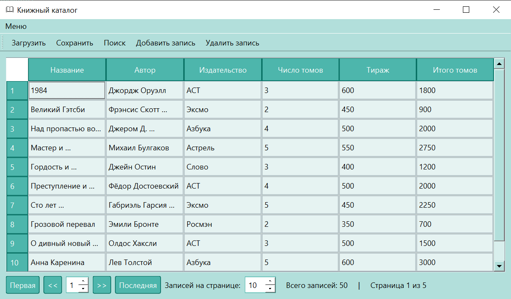
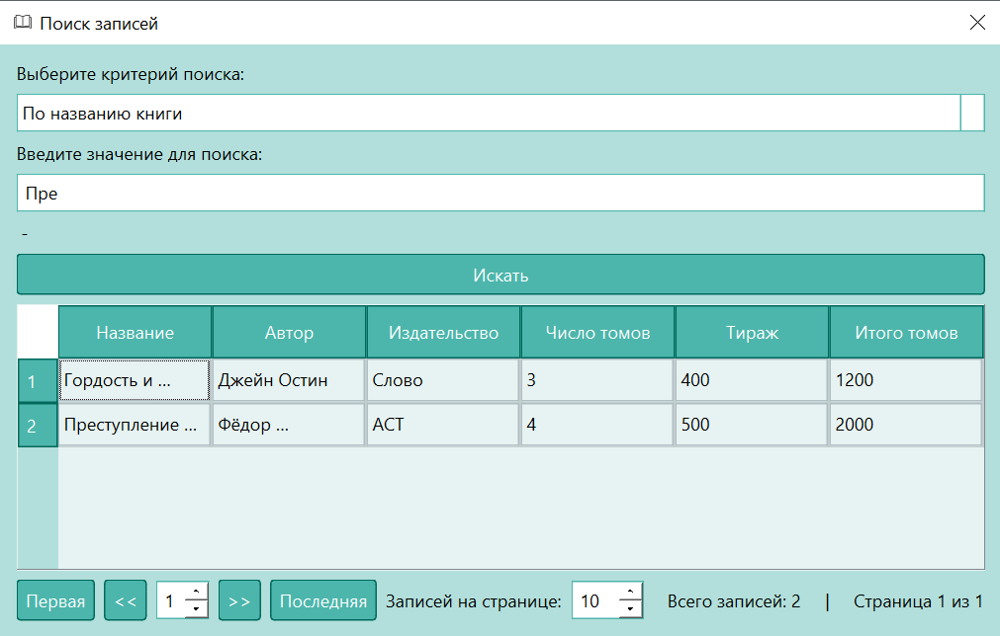
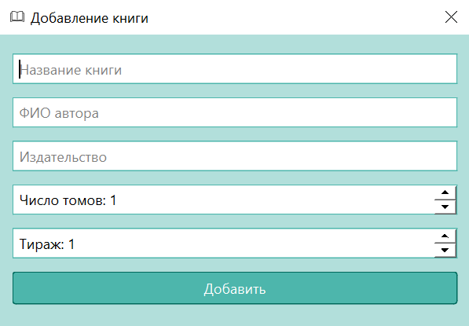
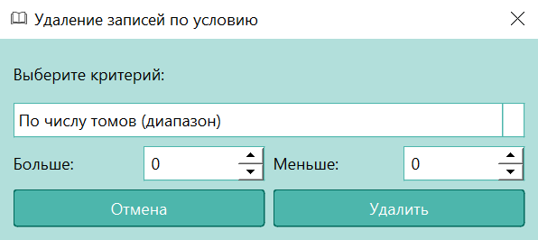

# Книжный каталог (Вариант 15)

## Описание
**Книжный каталог** — десктопное приложение на Python с использованием PyQt6 для управления записями о книгах. Оно позволяет загружать, сохранять, добавлять, искать и удалять записи, хранящиеся в XML-файлах. Приложение построено по паттерну **MVC** (Model-View-Controller), обеспечивая чёткое разделение данных, интерфейса и логики. Пользовательский интерфейс включает основное окно с таблицей, меню, панель инструментов (в том числе диалоговые окна для выполнения операций).

## Архитектура (MVC)
- **Model**: Управляет данными о книгах (`BookModel`, `BookRecord`).
- **View**: Отображает интерфейс (`MainWindow`, диалоговые окна: `AddRecordDialog`, `SearchDialog`, `DeleteRecordDialog`).
- **Controller**: Связывает модель и представление, обрабатывая действия пользователя (`BookController`, `SearchController`).

## Классы и их методы

### Модель (Model)

#### `BookRecord`
- **Описание**: Представляет запись о книге.
- **Атрибуты**:
  - `title`: Название книги (строка).
  - `author`: Автор (строка).
  - `publisher`: Издательство (строка).
  - `volumes`: Число томов (целое).
  - `circulation`: Тираж (целое).
  - `total_volumes`: Общее количество томов (`volumes * circulation`).
- **Методы**:
  - `to_tuple()`: Возвращает данные как кортеж для отображения в таблице.

#### `BookSAXHandler` (вспомогательный)
- **Описание**: Парсит XML-файлы с помощью SAX для загрузки данных.
- **Методы**:
  - `startElement(name, attrs)`: Обрабатывает начало тега.
  - `endElement(name)`: Создаёт `BookRecord` при закрытии тега `<book>`.
  - `characters(content)`: Считывает содержимое тегов.

#### `BookModel`
- **Описание**: Управляет списком записей о книгах.
- **Атрибуты**:
  - `records`: Список объектов `BookRecord`.
- **Методы**:
  - `add_record(record)`: Добавляет новую запись.
  - `get_records()`: Возвращает все записи.
  - `remove_record(record)`: Удаляет запись.
  - `clear()`: Очищает список записей.
  - `load_data_from_file(filename)`: Загружает данные из XML с помощью `BookSAXHandler`.
  - `save_data_to_file(filename)`: Сохраняет данные в XML с помощью `ElementTree`.

### Представление (View)

#### `MainWindow` (наследуется от `QMainWindow`, `PaginatedTableMixin`)
- **Описание**: Основное окно с таблицей записей, меню и панелью инструментов.
- **Компоненты**:
  - Меню: Действия для загрузки, сохранения, поиска, добавления, удаления и выхода.
  - Панель инструментов: Дублирует действия меню.
  - Таблица (`QTableWidget`): Колонки: "Название", "Автор", "Издательство", "Число томов", "Тираж", "Итого томов".
  - Пагинация: Кнопки ("Первая", "Предыдущая", "Следующая", "Последняя"), выбор страницы и количества записей.
- **Методы**:
  - `init_ui()`: Инициализирует интерфейс.
  - `create_menu()`: Создаёт меню.
  - `create_toolbar()`: Создаёт панель инструментов.
  - `create_table()`: Создаёт таблицу.
  - `connect_actions(controller)`: Связывает действия с контроллером.
  - `get_records_for_page()`: Возвращает записи для текущей страницы.
  - `update_table()`: Обновляет таблицу с учётом пагинации.

#### `AddRecordDialog` (наследуется от `QDialog`)
- **Описание**: Диалог для добавления новой книги.
- **Компоненты**:
  - Поля ввода (`QLineEdit`): Название, автор, издательство.
  - Поля чисел (`QSpinBox`): Число томов (1–100), тираж (1–1,000,000).
  - Кнопка "Добавить".
- **Методы**:
  - `get_record()`: Возвращает данные записи, рассчитывая `total_volumes`.

#### `SearchDialog` (наследуется от `BaseRecordFilterDialog`, `PaginatedTableMixin`)
- **Описание**: Диалог для поиска записей по критериям.
- **Компоненты**:
  - Выбор критерия (`QComboBox`): Автор, издательство, название, число томов, тираж, общее количество томов.
  - Поле ввода: Текст (`QLineEdit`) или диапазон (`QSpinBox` для min/max).
  - Таблица результатов (`QTableWidget`).
  - Пагинация: Аналогична `MainWindow`.
  - Кнопка "Искать".
- **Методы**:
  - `perform_search()`: Выполняет поиск и обновляет таблицу.
  - `get_records_for_page()`: Возвращает отфильтрованные записи.
  - `update_table()`: Обновляет таблицу результатов.

#### `DeleteRecordDialog` (наследуется от `BaseRecordFilterDialog`)
- **Описание**: Диалог для удаления записей по критериям.
- **Компоненты**:
  - Выбор критерия (`QComboBox`) и поле ввода (текст или диапазон).
  - Кнопки "Удалить" и "Отмена".
- **Методы**:
  - `handle_delete()`: Фильтрует записи и вызывает callback для удаления.

#### `BaseRecordFilterDialog` (наследуется от `QDialog`)
- **Описание**: Базовый класс для `SearchDialog` и `DeleteRecordDialog`, реализующий логику фильтрации.
- **Компоненты**:
  - Выбор критерия и поля ввода.
- **Методы**:
  - `toggle_fields()`: Показывает/скрывает поля в зависимости от критерия.
  - `filter_records()`: Фильтрует записи (поддерживает точное совпадение для текстовых полей).

#### `PaginatedTableMixin`
- **Описание**: Примесь для реализации пагинации в `MainWindow` и `SearchDialog`.
- **Компоненты**:
  - Кнопки пагинации, выбор страницы (`QSpinBox`), выбор количества записей.
  - Метка с информацией о страницах.
- **Методы**:
  - `init_pagination()`: Создаёт элементы пагинации.
  - `get_records_for_page()`: Абстрактный, возвращает записи для страницы.
  - `update_table_with_records()`: Обновляет таблицу.
  - `update_page_info()`: Обновляет информацию о страницах.
  - Навигация: `first_page()`, `prev_page()`, `next_page()`, `last_page()`, `change_page()`, `change_page_size()`.

### Контроллер (Controller)

#### `BookController`
- **Описание**: Управляет взаимодействием между `BookModel` и `MainWindow`.
- **Атрибуты**:
  - `model`: Экземпляр `BookModel`.
  - `view`: Экземпляр `MainWindow`.
  - `current_file`: Путь к текущему XML-файлу.
- **Методы**:
  - `set_view(view)`: Устанавливает представление и подключает действия.
  - `load_data()`: Загружает данные из XML через диалог выбора файла.
  - `save_data()`: Сохраняет данные в XML.
  - `open_add_record_dialog()`: Открывает `AddRecordDialog` и добавляет запись.
  - `open_search_dialog()`: Открывает `SearchDialog`.
  - `delete_record()`: Открывает `DeleteRecordDialog` для удаления.

#### `SearchController`
- **Описание**: Управляет поиском в `SearchDialog`.
- **Атрибуты**:
  - `dialog`: Экземпляр `SearchDialog`.
- **Методы**:
  - `perform_search()`: Выполняет фильтрацию и обновляет таблицу.

## Формат данных
Данные хранятся в XML-файлах:
```xml
<books>
    <book>
        <title>Название книги</title>
        <author>ФИО автора</author>
        <publisher>Издательство</publisher>
        <volumes>Число томов</volumes>
        <circulation>Тираж</circulation>
        <total_volumes>Итого томов</total_volumes>
    </book>
    ...
</books>
```xml

## Внешний вид программы

### Главное окно (MainWindow)


### Окно поиска книги (SearchDialog)


### Окно добавления книги (AddRecordDialog)


### Окно удаления книги (DeleteRecordDialog)

